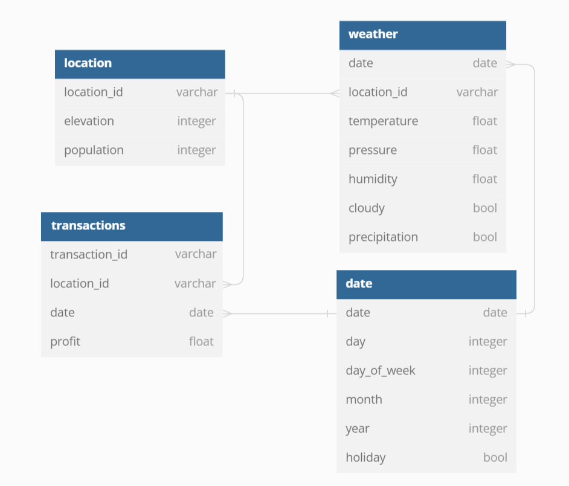

# 2024 CBG Data Engineering Internship Take-Home Coding Assessment

## Preface and Reminders

This take-home portion of the interview process is intended to get a sense of your skills in an applied setting and understand how you work through problems. The business scenario is hypothetical and the data is fully synthetic. We wanted to give you the opportunity to demonstrate your skills, creativity, coding style, and coding habits outside a time-boxed phone interview, as well as see how you make data-driven decisions.

Please do what you can over the next few days, and if you run out of time, document other ideas you had and what else you were planning to explore. Defining future work and follow-up questions helps give us further insight into how you were approaching the problem. If anything within the business scenario or problem statement seems ambiguous, please use that as an opportunity to take creative liberty and flex your ability to deliver solutions in the face of ambiguity.

Include your code and document the answers to the questions however you think is best. This is ***NOT*** intended to become a huge, overwhelming take-home problem - just do your best using the time you have available and try to have fun showing off your strengths!

## Business Scenario

Tyler’s Tubing is an outdoor recreation company that offers equipment rentals for river tubing during the summer months and snow tubing during the winter months. These activities are very seasonal and weather dependent, so the business only operates during certain times of the year. The overhead costs and day-to-day expenses are relatively low, and this small business has been profitable over the past few years.

Historical profit data from individual transactions (customers paying fees to rent equipment) and daily weather data are available from January 2019 through October 2022 for the locations, along with a few basic attributes of each location (population of the surrounding city and elevation at the location). Profits from transactions can occasionally be negative when the daily expenses are larger than the revenue being generated.

There are three different brands of systems used across the 10 existing Tyler's Tubing locations to collect transaction data and calculate the amount of profit from each transaction. The data fields stored by each system are the same, but the data formatting of the fields and the exported file formats differ depending on the brand of the system. Locations only operate during certain times of the year, and are closed on major holidays, so there will be time periods with no profit transaction data.

The process used to collect daily weather information isn’t perfect, so there is a small amount of missing weather data scattered throughout the dataset.

## Available Data

### Profit Data From Transaction Systems

| Field          | Description                                                 |
|----------------|-------------------------------------------------------------|
| location_id    | Unique identifier of the rental location                    |
| date           | Date when the transaction occurred                          |
| transaction_id | Unique identifier of the transaction                        |
| profit         | Amount of profit generated from the transaction in dollars  |

### Weather Data Collected Daily

| Field         | Description                                                                           |
|---------------|---------------------------------------------------------------------------------------|
| location_id   | Unique identifier of the rental location                                              |
| date          | Date when the weather measurements were collected                                     |
| temperature   | Average temperature during business operating hours in degrees Fahrenheit             |
| pressure      | Average atmospheric pressure during business operating hours in millibars             |
| humidity      | Average relative humidity during business operating hours, expressed as a percentage  |
| cloudy        | Boolean indicating if it was cloudy during operating hours                            |
| precipitation | Boolean indicating if there was precipitation during operating hours                  |

### Location City Population and Elevation

| Field         | Description                                                  |
|---------------|--------------------------------------------------------------|
| location_id   | Unique identifier of the rental location                     |
| population    | Population of the city where the rental location is located  |
| elevation     | Approximate elevation at the location in meters              |

### Dates of Major Holidays

| Field     | Description                              |
|-----------|------------------------------------------|
| date      | Date of the major holiday                |
| holiday   | Boolean indicating the date as a holiday |

## Problem Statement

Tyler's Tubing wants to store the data in a database and then query the database to answer some questions.

### ER Diagram

## Tasks

The following tasks should be performed in a Python Jupyter notebook using Sqlite as your database:

1. Create a subdirectory called `submission` to contain all of your submission code.
2. Perform some preliminary analysis and data quality checks on the data.  Detail your findings.
   * Is there anything unexpected about the data that you found?
   * Are there any data quality issues?  If so, what solutions do you propose?
3. Extract and transform the data to meet the data type specifications of the database. Make sure to annotate/describe what you are doing with comments in your code.
   * Address any of the data issues that you found you wish to fix.
   * Make sure to describe how you are handling any NULL/NA values.
4. Initialize a Sqlite database named `tubing`. 
5. Write and execute SQL DDL create table statements to create each of your tables with the designated column specifications to meet the requirements of the ER diagram. 
6. Load the transformed data into the database tables.
7. Suggest any additional columns or changes that you believe could improve the database (but do not implement them)
8. Write a SQL query that returns the following report, aggregated and ordered by location and date.  Think about how you can make the query both efficient and easy to read.  Come up with succinct, informative column names where appropriate.
   * location_id
   * date
   * temperature
   * daily sum of profit
   * indicator of positive or negative profit (i.e. string "positive" or "negative")
   * % change in daily profit compared to the previous available date (as a float)
   * rolling 30 day sum of daily profit per location (rolling 30 *calendar* days)
9. Run the query against the database and return the top 50 rows of your query result in the notebook. 
10. Explore the resulting data and describe anything of interest from the report, as well as any considerations that you think an end-user should keep in mind when interpreting/using the data.
11. Display the top 50 rows of the report result in the notebook.
12. Describe any additional metrics that you think would be useful to add to the report (without implementing them)

## Submission Expectations

1. Fork this repo to your personal github account.
2. Clone your fork and complete on the assignment as described above, while committing/pushing your work to your fork.
4. Submit your solution by emailing a link to your fork.  (See the assignment email for instructions on which email address to use)

Do **NOT** submit a pull request to this original repo.

If you don't know how to complete a part and can't figure it out after a bit of research, do your best to describe/document what you think should be done.  If you are unable to get the sqlite database working, do your best to perform the necessary data transformations in Pandas or Polars, but still write the SQL DDL create table statements to match the data model and try to write the SQL statement for the requested transaction analysis data/metrics.  Take care in formatting your code, queries, and answers.  Use comments and markdown cells in your code/notebook where appropriate.

## Hints
* There are some fields in the diagram that are not present in the raw data.  These are derived fields that you are expected to calculate as part of your data transformation. 
* Perform your preliminary data analysis and transformation using Pandas or Polars.
* You can write a Pandas or Polars dataframe directly to an existing database table.  
   * If you are using Pandas, you can pass your sqlite connection object directly to the `conn` argument of the `to_sql()` dataframe method.
   * If you are using Polars, you can pass the absolute sqlite URL path to the `connection` argument of the `write_database()` dataframe method.  For example, if your .db file is located at `db/tubing.db` relative to the working directory for your notebook, you can define the absolute path as `"sqlite:///" + os.path.abspath('db/tubing.db')`
* Similarly, can query your Sqlite database using the connection object and `pandas.read_sql_query()` or the connection URL string and `polars.read_sql()`.
* If you have never used Sqlite before, consider this an opportunity to showcase how you will work with a new technology.
   * The [Sqlite tutorial documentation](https://www.sqlitetutorial.net/sqlite-python/) can help you create a database and tables.  The [Sqlite Language documentation](https://www.sqlite.org/lang.html) can help clarify the flavor of SQL that Sqlite uses.
   * If you encounter errors with writing to the sqlite database, make sure that you have the latest versions of your packages installed, especially pyarrow, pandas/polars, and sqlalchemy.  Sqlite should already be installed in your python distribution.
   * Sqlite stores boolean columns as 0/1, but you can still query them with True/False values.  Please still define boolean columns as boolean in your DDL, but don't be alarmed if you see 0/1 stored in the table. 

